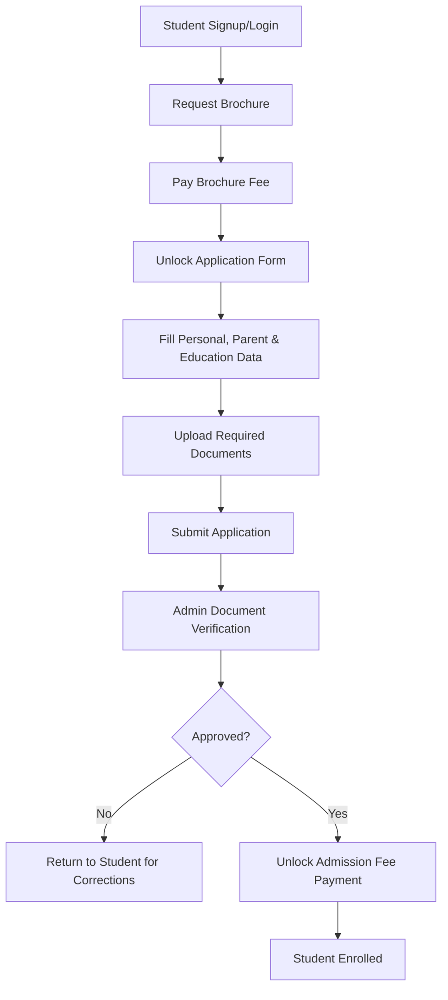

# PVG Unified ERP System - Complete Technical & User Documentation

> [!NOTE]
> This documentation provides an end-to-end overview of the PVG Unified ERP System, detailing the microservice architecture, authentication flows, the admission lifecycle, and the complete database schema.

## 1. Introduction
Welcome to the documentation for the **PVG Unified ERP (Enterprise Resource Planning) System**. 

This project solves a major operational challenge for PVG College: managing student admissions, user authentication, and administrator controls across separate modules. This project successfully unifies the **Authentication Module** and the **Admission Module** into a single, seamless digital campus experience.

In simple terms, this system allows:
- **Students** to create an account, log in securely, request brochures, submit admission forms, upload documents, and pay fees.
- **Administrators** to log in, view live telemetry data (e.g., active users), assign roles (like Admin, Management, or HOD), and review/approve student admission applications.

---

## 2. System Architecture (The Microservices)

This project relies on a modern microservices architecture. Instead of one monolithic app, it is split into 5 specialized services running simultaneously:

### The Backend Services
1. **Central Auth Backend (Port 8000):**
   - The core authentication engine of the ERP. Handles user registration, secure login, password hashing, and Role-Based Access Control (RBAC). 
   - Connects to a PostgreSQL database (`pvg_auth`).
2. **Admission Backend (Port 8001):**
   - Handles the entire student admission workflow. 
   - Manages brochure requests, saves uploaded documents, tracks application status (Draft, Pending, Approved, Rejected), and processes payments.

### The Frontend Portals
3. **Student Auth Gateway (Port 5175):**
   - **Audience:** New and returning students.
   - **Purpose:** A premium login and signup screen. Once a student authenticates, they are seamlessly redirected to the Admission Portal.
4. **Admission Portal (Port 5174):**
   - **Audience:** Students filling out forms AND Admins reviewing applications.
   - **Purpose:** Students buy brochures, fill out college applications, upload documents, and track progress. Admins access a restricted section of this portal to review submitted applications and verify documents.
5. **Auth Admin Dashboard (Port 5173):**
   - **Audience:** Top-level IT Administrators.
   - **Purpose:** A control panel displaying live telemetry statistics, active users, and tools to configure global permissions and role assignments.

---

## 3. Database Schema Details

The entire ERP relies on a relational database design. Below are the key tables spanning both Authentication and Admissions:

### Authentication & Authorization Tables
| Table Name | Key Fields | Purpose |
| :--- | :--- | :--- |
| **`users`** | `user_id`, `username`, `email`, `password_hash`, `status` | The unified master table storing all active accounts. |
| **`roles`** | `role_id`, `role_name`, `description` | Defines system roles (e.g., Admin, Student, Guest). |
| **`user_roles`** | `user_role_id`, `user_id`, `role_id` | A junction table associating users with their specific roles. |
| **`students`** | `id`, `name`, `username`, `student_class`, `phone` | The **legacy** student table. Kept for backward compatibility and JIT migration. |

### Admission Lifecycle Tables
| Table Name | Key Fields | Purpose |
| :--- | :--- | :--- |
| **`brochure_request`** | `brochure_id`, `user_id`, `course_name`, `brochure_status` | Tracks when a student requests a course brochure. |
| **`bro_payment`** | `payment_id`, `brochure_id`, `amount`, `status` | Records the ₹200 fee payment for the requested brochure. |
| **`application`** | `application_id`, `user_id`, `brochure_id`, `current_status` | The central table linking all admission form parts together. Tracks the overall status (Draft, Pending, Verified, etc.). |
| **`applicant_details`** | `application_id`, `full_name`, `dob`, `adhar_number`, `addresses` | Stores the applicant's core personal data, demographics, and addresses. |
| **`parent_details`** | `application_id`, `name`, `mother_name`, `annual_income`, `mobile_number` | Captures financial and parental contact information. |
| **`education_details`** | `application_id`, `university_board`, `passout_year`, `percentage` | Tracks the student's previous academic history and exam results. |
| **`documents`** | `doc_id`, `application_id`, `document_type`, `file_path`, `status` | Records metadata and filesystem paths for uploaded files (e.g., Aadhar, Photos). |
| **`document_verification`** | `verification_id`, `document_id`, `admin_id`, `status` | Tracks which admin verified/rejected a specific document and their remarks. |

---

## 4. The Unified Authentication Flow (JIT Migration)

> [!TIP]
> The JIT (Just-In-Time) Migration solves the challenge of merging thousands of legacy students into a modern, highly-secure RBAC table without data loss or manual database scripts.

**The Challenge:**
Old students were saved in a legacy `students` database table, but the modern ERP requires users to be registered in the new `users` database table.

**The Flow:**
1. A student enters their ID and Password on the Student Gateway.
2. The system checks the new, secure `users` table. 
3. If not found, the system automatically checks the old legacy `students` table. 
4. If the credentials match the legacy table, the system **migrates** the student, creating a brand new secure profile for them in the `users` table, and logs them in instantly. 
5. Newly signing up students are automatically provisioned into the `users` table directly.

---

## 5. The Complete Admission Module Flow

The admission module is designed as a rigid, step-by-step pipeline. Students cannot skip steps.

**Step-by-Step Breakdown:**
1. **Brochure Request & Payment:** A student selects their desired course and pays the initial brochure fee. This creates a `brochure_request` and a `bro_payment` entry.
2. **Application Draft:** Upon successful payment, an `application` row is created with status = `draft`. 
3. **Data Entry:** The student completes their `applicant_details`, `parent_details`, and `education_details`.
4. **Document Upload:** The student uploads mandated proofs (Photo, Signature, Aadhar, etc.). Files are saved to the server and logged in the `documents` table.
5. **Submission:** The application status changes to `pending`.
6. **Admin Verification:** An Administrator logs in via the Admission Portal, reviews the data, and verifies the documents. Verification events are logged securely in `document_verification` to track which admin approved what document.
7. **Enrollment:** Once the Admin approves the application, the student is prompted to pay the final admission fee, marking the application as `enrolled`.

---

## 6. How to Run the Project

1. Locate the **`start_erp.bat`** file in the root directory.
2. Run `.\start_erp.bat` in your terminal.
3. The script automatically executes cleanup sequences to free up heavily-used ports.
4. Five distinct processes are launched concurrently:
   - **Auth Admin Portal:** `http://localhost:5173`
   - **Admission Portal:** `http://localhost:5174`
   - **User Gateway:** `http://localhost:5175`
   - **Backends:** Running securely on 8000 & 8001.

---

## 7. Troubleshooting

> [!WARNING]
> Modifying backend Python files will not trigger automatic reloads because the startup batch script does not use the `--reload` flag.

- **Applying Code Changes:** If you edit any backend code, close all open terminals and run `start_erp.bat` again. 
- **Port Conflicts:** If you see an error saying a port is blocked, running `start_erp.bat` usually resolves this automatically by hunting down ghost processes on ports 8000, 8001, 5173, 5174, and 5175.
- **Login Failures:** Ensure the backend PostgreSQL database is running and the `.env` credentials in `backend/` and `admission_module/` are accurate.
